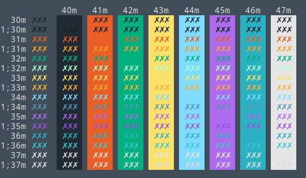
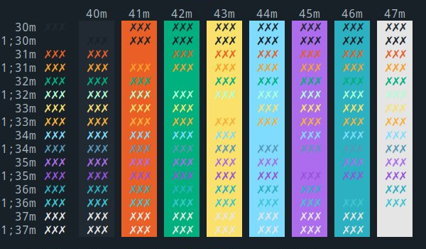
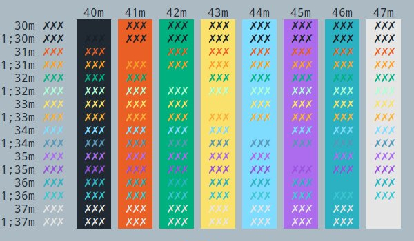
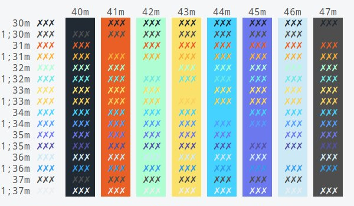

<p align="center"></p>

<p align="center">A collection of color themes that match internal style guides</p>

<p align="center">Designed for consistency. With love from Cale.</p>

---

### Default colors:

<p align="center"></p>

### Dark colors:

<p align="center"></p>

### Pastel colors:

<p align="center"></p>

### Light colors:

<p align="center"></p>

Support for:

* XFCE4 Terminal
* Gnome Terminal
* qterminal
* iTerm2 [Manual]
* Xresources (urxvt) [Manual]
* st [Manual] 
* dwm [Manual]
* slock [Manual]

## Getting started

### Download

Grab the latest `tar.gz` file from the [Color7 Release's Page](https://github.com/cblack-r7/color7/releases/), and untar it.

Then enter the `color7` directory and follow the installation steps for your preferred terminal.

### Installation

If you are running Gnome:

```shell
make install_gnome
```

Or if you are running XFCE4:

```shell
make install_xfce
```

Then change the appropriate scheme from built in drop down menus.

If you are running any other scheme please see the below Manual instructions.

#### iTerm2

To install the themes simply:
* Launch iTerm
* Type `CMD`+`i`
* Navigate to Colors tab
* Click on `Load Presets`
* Click on `Import`
* Select the `.itermcolors` inside of the `./output/iterm/` directory.
* Click on Load Presets and choose a color scheme.

#### Other

The dwm, st, slock and .Xresources terminals depends very heavily on user configuration and should be manually patched into their prosepective environments.

#### ZSH Theme

The project also includes a zsh theme that was quite popular at the time. Simply copy it into your `.oh-my-zsh/themes` directory and change the `.zsh` theme option to point to the new file (by name)
