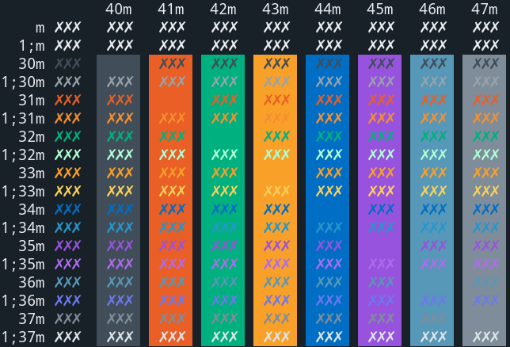
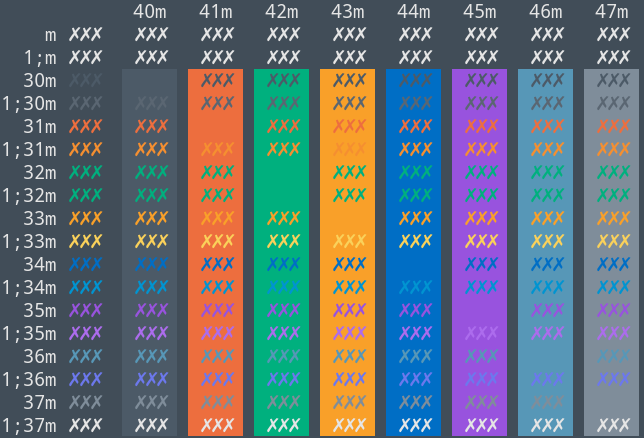
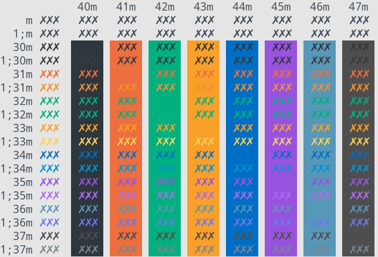

<p align="center"></p>

<p align="center">A collection of color themes that match internal style guides</p>

<p align="center">Designed for consistency. With love from Cale.</p>

---

<p align="center"><blockquote>Default colors.</blockquote></p>
<p align="center"><blockquote>Pastel colors.</blockquote></p>
<p align="center"><blockquote>Light colors.</blockquote></p>

Support for:
* XFCE4 Terminal
* Gnome Terminal
* iTerm2 [Manual]
* Xresources (urxvt) [Manual]
* st [Manual] 
* dwm [Manual]
* slock [Manual]

## Getting started
### Installation
If you are running Gnome (default in Kali):
```shell
make gnome
```
Or if you are running XFCE4:
```shell
make xfce
```
Then change the appropriate scheme from built in drop down menus.

If you are running any other scheme please see the below Manual instructions.

#### iTerm2
To install the themes simply:
* Launch iTerm
* Type `CMD`+`i`
* Navigate to Colors tab
* Click on `Load Presets`
* Click on `Import`
* Select the `.itermcolors` inside of the `./iterm/` directory.
* Click on Load Presets and choose a color scheme.

